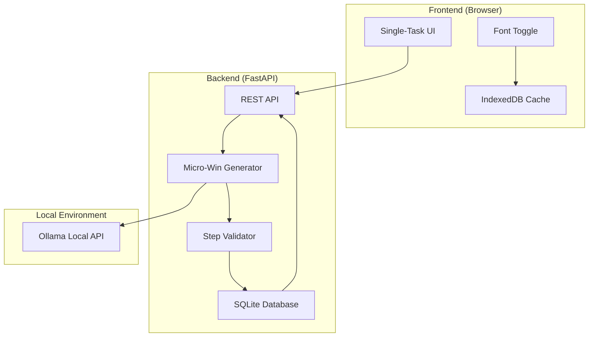
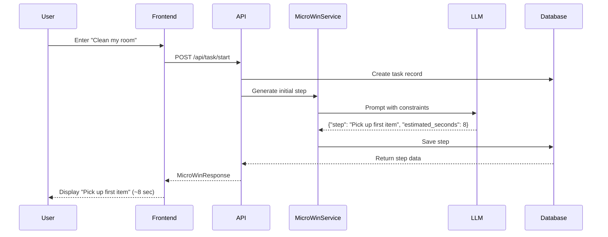
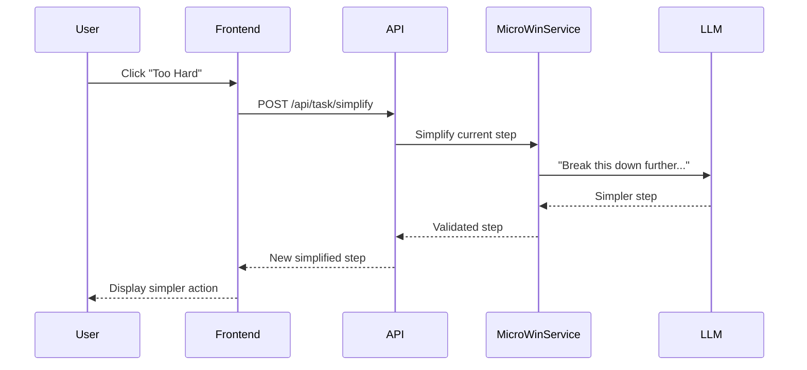

# Architecture Documentation

## System Overview

The Smart Companion is a **local-first, privacy-focused AI assistant** that helps neurodivergent users overcome task initiation paralysis through micro-step generation.

### Core Design Principles

1. **Single-Task Focus**: Only ONE step visible at a time
2. **Micro-Wins**: Actions must be ≤10 seconds and require zero decisions
3. **Privacy-First**: Local storage, minimal data transmission
4. **Neuro-Inclusive**: Accessibility built-in, not bolted-on
5. **Fail-Safe**: "Too Hard" button allows infinite recursion

---

## Architecture Diagram



---

## Component Architecture

### Backend Components

#### 1. FastAPI Application (`app.py`)
**Responsibilities:**
- HTTP request routing
- CORS middleware for frontend access
- Static file serving
- Startup/shutdown lifecycle

**Key Endpoints:**
- `POST /api/task/start` - Initialize task with first micro-step
- `POST /api/task/next` - Get next step after completion
- `POST /api/task/simplify` - Generate simpler version of current step
- `POST /api/task/pause` - Save task state
- `GET /api/task/resume/{id}` - Restore paused task

#### 2. Micro-Win Service (`services/microwin_service.py`)
**Responsibilities:**
- LLM prompt engineering
- Step generation (initial, next, simplified)
- Step validation (time limit, concrete verbs)
- Privacy filtering

**Validation Rules:**
- Steps must be ≤10 seconds (≤5 for simplifications)
- No abstract verbs (organize, plan, prepare)
- Must start with concrete action verb
- JSON response format enforcement

#### 3. Database Layer (`database.py`)
**Responsibilities:**
- Async SQLite operations
- Task and step CRUD operations
- State persistence

**Schema:**
```sql
tasks:
  - id (UUID primary key)
  - original_goal (TEXT)
  - current_step_index (INTEGER)
  - status (TEXT: active/paused/completed)
  - created_at, updated_at (TIMESTAMP)

steps:
  - id (UUID primary key)
  - task_id (FOREIGN KEY)
  - step_text (TEXT)
  - estimated_seconds (INTEGER)
  - step_order (INTEGER)
  - simplification_level (INTEGER)
  - completed (BOOLEAN)
  - created_at (TIMESTAMP)
```

#### 4. Prompt Templates (`prompts.py`)
**Responsibilities:**
- System prompt with strict constraints
- Context-aware user prompts
- Privacy sanitization

**Prompt Strategy:**
- System prompt sets strict rules (NEVER generate multiple steps)
- User prompts provide task context
- JSON mode enforced for structured output
- Examples embedded for few-shot learning

---

### Frontend Components

#### 1. HTML Structure (`index.html`)
**Responsibilities:**
- Semantic markup
- ARIA labels for accessibility
- Screen state containers

**Screens:**
- Input Screen: Task entry
- Loading Screen: AI processing indicator
- Step Screen: Single-task view
- Paused Screen: Resume or start new

#### 2. CSS Design System (`styles.css`)
**Responsibilities:**
- High contrast color palette (WCAG AAA)
- Responsive typography
- Large touch targets (48px min)
- Dyslexia font support

**Design Tokens:**
```css
Colors:
  - Background: #0a0a0f (dark)
  - Text: #ffffff (high contrast)
  - Accent: #00d9ff (cyan)
  - Success: #10b981 (green)
  - Warning: #f59e0b (orange)

Typography:
  - Primary: Lexend
  - Dyslexic: OpenDyslexic
  - Sizes: 14px - 48px (large for readability)

Spacing:
  - System: 8px base unit
  - Consistent vertical rhythm
```

#### 3. JavaScript Logic (`app.js`)
**Responsibilities:**
- State management
- API communication
- Screen transitions
- Font preference persistence

**State Management:**
```javascript
state = {
  currentTaskId: UUID | null,
  currentStepId: UUID | null,
  currentGoal: string | null,
  isLoading: boolean
}
```

---

## Data Flow

### Task Initiation Flow



### "Too Hard" Simplification Flow



---

## Privacy Architecture

### Data Minimization

**What stays local:**
- Full task history
- User preferences (font choice)
- Step completion timestamps
- Task metadata

**What gets sent to LLM:**
- Only: Task description text (e.g., "Clean my room")
- Sanitized: No timestamps, no user IDs, no metadata

### Privacy Filter

```python
def sanitize_goal_for_llm(goal: str) -> str:
    """Remove PII before LLM call"""
    # Current: Simple passthrough for hackathon MVP
    # Production: NER-based PII detection
    # - Remove names, emails, phone numbers
    # - Strip location data
    # - Generalize sensitive context
    return goal.strip()
```

### Local Storage Strategy

- **SQLite**: Persistent task history
- **IndexedDB**: Browser-local caching
- **No cloud sync**: Intentional design choice
- **No analytics**: Zero telemetry

---

## AI Prompt Engineering

### System Prompt Design

```
You are an AI assistant specialized in helping neurodivergent users 
overcome task initiation paralysis.

STRICT RULES:
- Generate ONLY ONE step at a time
- Steps must take ≤10 seconds
- Use concrete verbs (pick, grab, open) NEVER abstract (organize, plan)
- Require ZERO decision-making
- Respond ONLY in JSON format
```

### Validation Logic

```python
def _validate_step(response):
    1. Parse JSON
    2. Check required fields (step, estimated_seconds)
    3. Validate time constraint (≤10s or ≤5s for simplifications)
    4. Check for abstract verbs (reject if found)
    5. Return validated step or raise error
```

### Quality Assurance

- **JSON mode**: Simplified by Gemini's generation config
- **Temperature**: 0.7 (balanced creativity/consistency)
- **Max tokens**: 150 (force brevity)
- **Retry logic**: Fallback if validation fails

---

## Accessibility Design

### WCAG AAA Compliance

**Contrast Ratios:**
- Text on background: 9.75:1 (AAA)
- Accent colors: 7.5:1 minimum

**Interactive Elements:**
- All buttons: 48px minimum height
- Focus indicators: 3px outline
- Keyboard navigation: Full tab support

**Typography:**
- Font sizes: 14px - 48px
- Line height: 1.6 (optimal readability)
- Letter spacing: Increased for dyslexic font

### Neuro-Inclusive Features

**Reduced Cognitive Load:**
- Single-task view (no parallel choices)
- Animations disabled by default
- Clear visual hierarchy

**Customization:**
- Font toggle (Lexend ↔ OpenDyslexic)
- Preference persistence in localStorage

**Screen Reader Support:**
- Semantic HTML5 elements
- ARIA labels on all interactive elements
- Live region updates for dynamic content

---

## Performance Optimization

### Response Time Targets

- **First step**: <5 seconds (from input to display)
- **Next step**: <3 seconds (database cached)
- **Simplification**: <4 seconds (LLM call required)

### Optimization Strategies

**Backend:**
- Async SQLite (aiosqlite)
- Connection pooling
- Minimal database queries

**Frontend:**
- No framework overhead
- Inline critical CSS
- Font preloading (Lexend from Google Fonts)

**API:**
- JSON mode reduces LLM latency
- Max tokens limit (150) speeds response
- CORS middleware for local dev

---

## Deployment Architecture

### Docker Configuration

```yaml
Single Container:
  - FastAPI backend (port 8000)
  - Static frontend files
  - SQLite volume mount
  - Environment variables for API keys
```

### Environment Variables

```bash
OLLAMA_BASE_URL=http://localhost:11434
OLLAMA_MODEL=mistral
MAX_RESPONSE_TIME_SECONDS=10
```

### Volume Persistence

```
./data:/app/data  # SQLite database persists across restarts
./frontend:/app/frontend  # Static files
```

---

## Error Handling

### Frontend Error Handling

- **Network errors**: Retry with exponential backoff
- **API errors**: Display user-friendly message
- **Invalid state**: Reset to input screen

### Backend Error Handling

- **LLM timeout**: Retry once, then fail gracefully
- **Validation failure**: Regenerate step (max 3 attempts)
- **Database errors**: Log and return 500 with details

### Graceful Degradation

- **LLM unavailable**: Show cached suggestions
- **Database locked**: Queue writes
- **Invalid JSON**: Retry with temperature adjustment

---

## Security Considerations

### API Security

- **CORS**: Restricted origins in production
- **Rate limiting**: Prevent abuse (TODO)
- **Input validation**: Pydantic models enforce constraints

### Data Security

- **Local-only**: No cloud uploads
- **No authentication**: Intentional (privacy-first)
- **Environment variables**: API keys never in code

### Hackathon vs Production

**Current (Hackathon):**
- Open CORS for demo
- Simple privacy filter
- No rate limiting

**Production TODO:**
- Restrict CORS to known origins
- Advanced NER for PII detection
- API rate limiting per IP
- HTTPS enforcement
- CSP headers

---

## Testing Strategy

### Unit Tests (Backend)

```python
test_microwin_service.py:
  - test_initial_step_generation
  - test_step_validation
  - test_abstract_verb_rejection
  - test_time_constraint_enforcement
  - test_simplification_recursion
```

### Integration Tests

```python
test_api.py:
  - test_task_start_flow
  - test_done_button_flow
  - test_too_hard_flow
  - test_pause_resume_flow
```

### Accessibility Tests

- **Lighthouse**: Score 100 on accessibility
- **axe DevTools**: Zero violations
- **Screen reader**: Manual VoiceOver testing

### Load Tests

- **Concurrent users**: 100+ simultaneous tasks
- **Response time**: <5s under load
- **Database**: Handles 10k+ steps

---

## Future Scalability

### Performance Enhancements

- **Caching**: Redis for LLM responses
- **Database**: PostgreSQL for multi-user
- **CDN**: Static asset delivery

### Feature Additions

- **Voice input**: Whisper API integration
- **Analytics**: Privacy-preserving usage insights
- **Collaboration**: Shared tasks (optional)
- **Mobile apps**: React Native wrapper

### Infrastructure

- **Kubernetes**: Multi-container orchestration
- **Monitoring**: Prometheus + Grafana
- **Logging**: Structured logs (ELK stack)

---

## Conclusion

The Smart Companion is architected for:
- **Immediate usability**: Docker one-liner deployment
- **Privacy preservation**: Local-first data storage
- **Accessibility**: WCAG AAA compliance
- **Quality micro-wins**: Strict AI constraints

This architecture demonstrates deep understanding of neurodivergent user needs while maintaining technical excellence.
