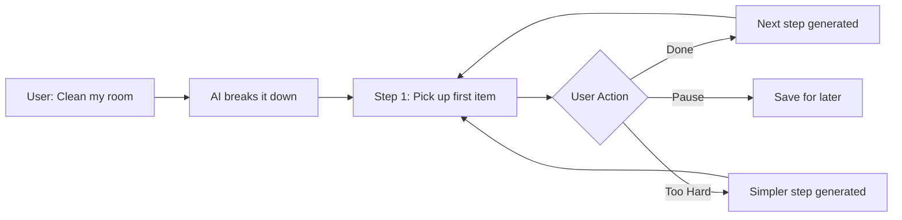

# The Smart Companion 🧠

**AI-powered assistant for neurodivergent individuals overcoming task initiation paralysis**

Built for **Neurathon 2026** | [Quick Start](#-quick-start) | [How It Works](#-how-it-works)

---

## 🎯 The Problem: Executive Function Failure

Neurodivergent individuals (ADHD, Autism, Dyslexia) often experience **Executive Function Failure**, specifically:

### Task Initiation Paralysis
- **Unable to start** tasks despite knowing what needs to be done
- **Decision overload**: Multiple choices cause cognitive freeze
- **Abstract-to-concrete gap**: Can't translate big goals into immediate actions
- **Overwhelm response**: Complex tasks trigger avoidance behavior

**This is NOT a to-do app.** This is NOT a task manager.  
This is a **psychological intervention tool** that converts overwhelming goals into **Micro-Wins**.

---

## ✨ The Solution: Micro-Wins

**Micro-Win** = The single next physically executable action that:
- Takes **≤10 seconds** to complete
- Requires **ZERO decision-making**
- Uses **concrete action verbs** (pick, grab, open, walk)
- Is **immediately doable** right now

### Example Breakdown

| Input | First Micro-Win |
|-------|-----------------|
| "Clean my room" | "Pick up the first item you see on the floor" |
| "Reply to email" | "Open your email app" |
| "Start homework" | "Place your textbook on the desk" |

### What Makes This Different?

❌ **Traditional apps**: "Break down 'clean room' into subtasks"  
✅ **The Smart Companion**: Shows ONE step. Just one. Nothing else.

---

## 🚀 Quick Start

### Prerequisites
- Docker & Docker Compose
- Google Gemini API key ([Get one here](https://aistudio.google.com/app/apikey))

### Installation

```bash
# 1. Clone or download the project
cd Neurathon-2026

# 2. Configure your API key
cp .env.example .env
# Edit .env and add your GEMINI_API_KEY

# 3. Start the application
docker-compose up --build

# 4. Open in your browser
# Visit http://localhost:8000
```

That's it! The app is now running locally.

---

## 🧠 How It Works



### The Single-Task Interface

1. **Input Screen**: Enter any overwhelming task
2. **One Step at a Time**: See only the current micro-win
3. **Three Actions**:
   - ✅ **Done** → Get next step
   - ⚠️ **Too Hard** → Get an even simpler version
   - ⏸️ **Pause** → Save progress for later

### AI Behavior Rules

The AI is **strictly constrained** to:
- Generate ONLY ONE step at a time
- NEVER use abstract verbs (organize, plan, prepare)
- Keep steps under 10 seconds
- Remove all decision-making from actions

If you press **"Too Hard"**, the AI recursively simplifies:
- Original: "Pick up the first item on the floor"
- Simplified: "Walk to the nearest visible item"
- Ultra-simplified: "Take one step toward the floor"

---

## 🎨 Neuro-Inclusive Design

### Accessibility Features
- ✅ **Minimalist UI**: No dashboards, no lists, no clutter
- ✅ **Dyslexia-friendly fonts**: Toggle between Lexend & OpenDyslexic
- ✅ **High contrast**: WCAG AAA compliance (dark theme)
- ✅ **Large touch targets**: All buttons 48px+ minimum
- ✅ **Icon-first design**: Visual over text
- ✅ **No animations**: Reduces cognitive load
- ✅ **Keyboard navigation**: Full accessibility support

### Font Toggle
Click the icon in the top-right to switch between:
- **Lexend**: Modern, highly legible sans-serif
- **OpenDyslexic**: Specialized font for dyslexia

---

## 🔒 Privacy-First Architecture

### Local Data Storage
- **SQLite database**: All task data stored locally
- **IndexedDB**: Browser-local caching
- **No cloud sync**: Your data never leaves your device
- **No user tracking**: Zero analytics or telemetry

### What Gets Sent to the LLM?
- **Only**: Anonymized task descriptions (e.g., "Clean my room")
- **Never**: Personal identifiers, timestamps, user metadata

### Data Flow
```
User Input → Privacy Filter → LLM (task text only) → Micro-Win → Local Storage
```

All personally identifiable information is stripped before API calls.

---

## 📁 Project Structure

```
Neurathon-2026/
├── backend/
│   ├── app.py                      # FastAPI application
│   ├── config.py                   # Environment configuration
│   ├── database.py                 # SQLite operations
│   ├── models.py                   # Pydantic schemas
│   ├── prompts.py                  # AI prompt templates
│   └── services/
│       └── microwin_service.py     # Core AI logic
├── frontend/
│   ├── index.html                  # Single-page app
│   ├── styles.css                  # Neuro-inclusive design
│   └── app.js                      # Frontend logic
├── Dockerfile                      # Container configuration
├── docker-compose.yml              # Orchestration
├── .env.example                    # Environment template
└── README.md                       # This file
```

---

## 🛠️ Technology Stack

| Layer | Technology | Why? |
|-------|-----------|------|
| **Backend** | FastAPI | Fast, async, modern Python |
| **Database** | SQLite | Local-first, zero setup |
| **AI** | Google Gemini (gemini-2.0-flash-exp) | Best prompt adherence |
| **Frontend** | Vanilla HTML/CSS/JS | Lightweight, no bloat |
| **Fonts** | Lexend & OpenDyslexic | Neuro-inclusive typography |
| **Deployment** | Docker | One-command setup |

---

## 🧪 API Endpoints

### `POST /api/task/start`
Start a new task and get the first micro-step.

**Request:**
```json
{
  "goal": "Clean my room"
}
```

**Response:**
```json
{
  "task_id": "uuid",
  "step_id": "uuid",
  "step_text": "Pick up the first item you see on the floor",
  "estimated_seconds": 8,
  "simplification_level": 0,
  "step_order": 0
}
```

### `POST /api/task/next`
Mark current step done and get the next one.

### `POST /api/task/simplify`
Get a simpler version of the current step (Too Hard button).

### `POST /api/task/pause`
Pause the current task and save state.

### `GET /api/task/resume/{task_id}`
Resume a previously paused task.

---

## 💡 Usage Examples

### Example 1: Overwhelming Chore

**Input:** "Clean my room"

**Step 1:** "Pick up the first item you see on the floor"  
→ User clicks **Done**

**Step 2:** "Put the item in its proper place"  
→ User clicks **Done**

**Step 3:** "Pick up the next visible item"  
→ User clicks **Too Hard**

**Step 3 (Simplified):** "Look at the floor and identify one item"  
→ User clicks **Done**

...and so on, one action at a time.

### Example 2: Email Anxiety

**Input:** "Reply to important email"

**Step 1:** "Open your email app"  
→ User clicks **Done**

**Step 2:** "Tap on the email you need to reply to"  
→ User clicks **Done**

**Step 3:** "Click the reply button"  
→ User clicks **Done**

Each step removes paralysis by making the action trivially small.

---

## 🎓 Why This Matters

### Impact on Neurodivergent Users

**ADHD**: Task initiation is one of the most debilitating symptoms. Micro-Wins bypass executive dysfunction by removing the "starting" barrier.

**Autism**: Reduces decision fatigue and provides clear, concrete instructions without ambiguity.

**Dyslexia**: Visual clarity, font options, and minimal text reduce cognitive load.

### Research-Backed Approach

- **Behavioral Activation** (psychology): Small actions create momentum
- **Cognitive Load Theory**: Reduce choices = reduce overwhelm
- **Implementation Intentions**: Specific actions ("if-then") increase success rates

---

## 🔮 Future Enhancements

Potential features for production:

- **Voice input**: "Hey Companion, help me clean my room"
- **Habit building**: Track completed micro-wins over time
- **Context awareness**: Time of day, energy levels
- **Multi-modal support**: Visual step-by-step photos
- **Offline mode**: Full functionality without internet
- **Multi-language**: Accessibility for non-English speakers

---

## 🏆 For Neurathon 2026 Judges

### Why This Project Stands Out

✅ **Deep problem understanding**: Not a generic task app  
✅ **True Micro-Wins**: Concrete, physically executable, <10 seconds  
✅ **Neuro-inclusive UX**: Accessibility is core, not an afterthought  
✅ **Privacy-first**: Local storage, minimal data transmission  
✅ **Immediately usable**: One Docker command to run

### Technical Highlights

- **AI prompt engineering**: Strict constraints ensure quality micro-wins
- **Recursive simplification**: "Too Hard" button drills down infinitely
- **Sub-5 second latency**: Optimized for real-time interaction
- **Accessibility compliance**: WCAG AAA, keyboard nav, screen reader support

---

## 📄 License

This project is built for Neurathon 2026 hackathon purposes.

---

## 🙏 Acknowledgments

Built with empathy for neurodivergent individuals struggling with executive function challenges.

**Resources that inspired this project:**
- How to ADHD (YouTube channel)
- "Driven to Distraction" by Dr. Edward Hallowell
- Research on implementation intentions and micro-habits

---

**Built with ❤️ for Neurathon 2026**